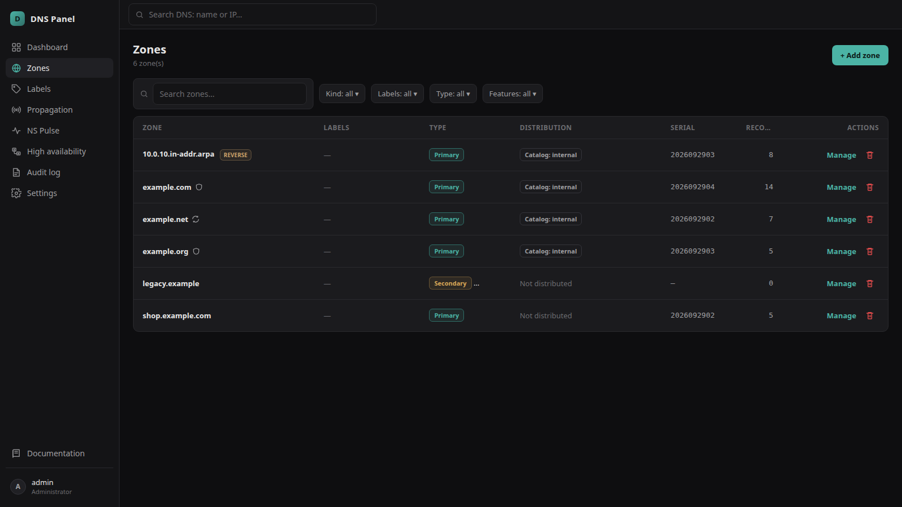
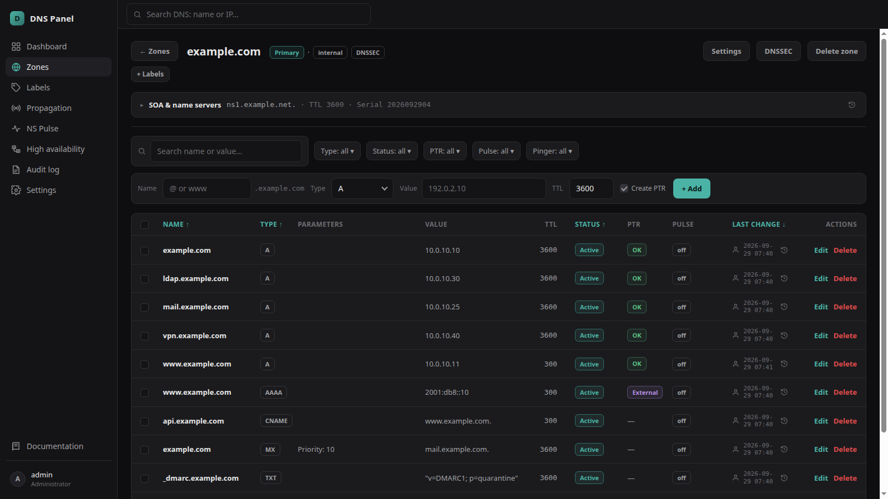
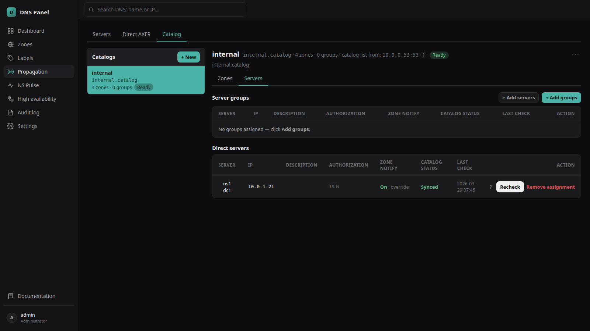
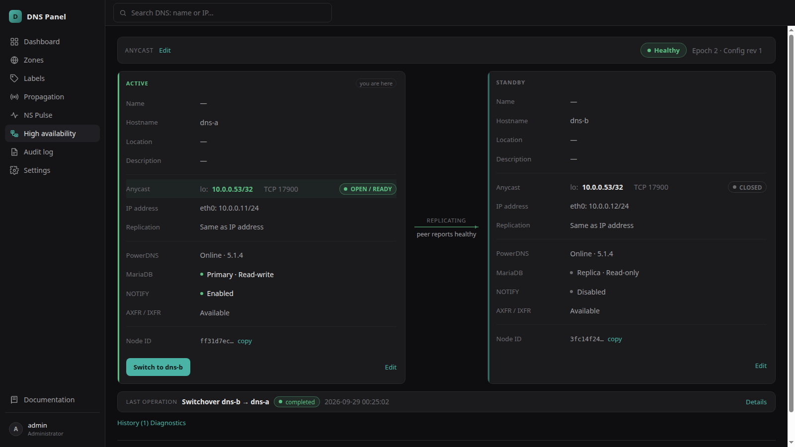
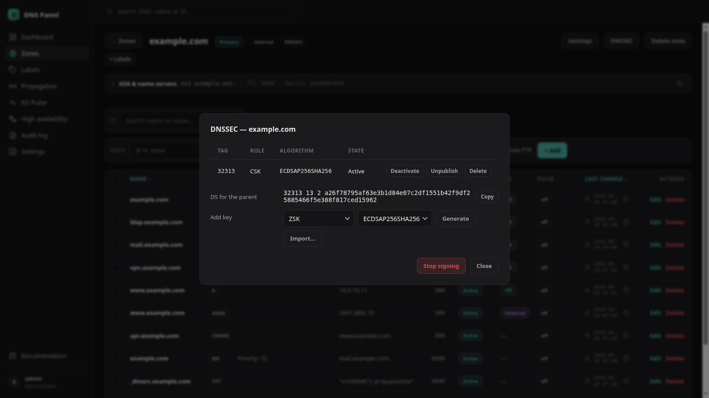

# DNS Panel

A web panel for running an internal DNS: **PowerDNS as the hidden primary** (MySQL/MariaDB backend) and any
number of secondaries (BIND or anything that speaks AXFR/NOTIFY). Zones and records, distribution to
secondaries, DNSSEC, migration from an old BIND master, an active/standby pair — managed from one place, with
permissions and an audit log. Automation and AI assistants use the same rules through an HTTP API and an MCP
server.



## Features

- **Zones and records** — primary and secondary zones, forward and reverse, RRset editing with automatic
  PTR, SOA/NS profiles, labels, search across all zones.
- **Distribution** — secondaries, their groups and TSIG keys; zones reach them through RFC 9432 catalog zones
  or direct AXFR, with NOTIFY and a per-server view of what arrived.
- **DNSSEC** — online signing by PowerDNS, key management, DS for the parent; signed zones migrate with
  their own keys, so validation never breaks.
- **Migration** — reads an old BIND master's configuration, imports its zones as secondaries, then turns
  them into primaries one by one; dynamic-update settings and DNSSEC keys come along.
- **Dynamic DNS** — RFC 2136 updates from DHCP servers, by TSIG key and/or address, per zone or by profile.
- **High availability** — two nodes, MariaDB replication, anycast or floating service address, switchover
  in seconds, fenced standby, emergency paths. Built in the panel from two standalone nodes.
- **NS Pulse** — remote testers (ICMP/TCP) and rules that switch a record to a backup set while a check fails;
  Pinger watches every A/AAAA address.
- **Users and access** — password, TOTP and client-certificate sign-in; per-zone read/write access and
  capabilities through groups; personal denies; full audit log.
- **HTTP API and MCP** — `/dns-api/v1/` with OpenAPI, remote MCP at `/mcp`; API tokens, any number of OIDC
  providers (Microsoft Entra, Keycloak, Okta…), optional anonymous read. Every call acts as a real panel user.

| | |
|---|---|
|  |  |
|  |  |

## How it works

```
          browser / API / MCP
                  │
        ┌─────────▼─────────┐      replication      ┌───────────────────┐
        │  node A (ACTIVE)  │ ────────────────────▶ │  node B (STANDBY) │
        │  panel · PowerDNS │                       │  panel · PowerDNS │
        │  MariaDB · agents │                       │  read-only        │
        └─────────┬─────────┘                       └───────────────────┘
                  │ NOTIFY / AXFR (catalogs, TSIG)
      ┌───────────┼───────────┐
   secondary   secondary   secondary      ← BIND, answer the clients
```

The panel writes zones straight into the PowerDNS database, checks the result on the live server and sends
NOTIFY; secondaries transfer the zones. Secondaries are only observed over DNS, never configured by the panel.

Stack: Perl (FastCGI) and plain JavaScript with no build step; background daemons in Go; PowerDNS 5.1,
MariaDB, Apache. No containers.

## Install

Requirements: Ubuntu 24.04 or 26.04 (a VM or an LXC container) with internet access to `repo.powerdns.com`.

From [Releases](https://github.com/ds1919/dns-panel/releases) take `dns-panel_<version>_amd64.deb` and
`powerdns-repo.sh` (checksums in `SHA256SUMS`), then as root on the node:

```bash
sh powerdns-repo.sh                      # adds the PowerDNS 5.1 repository the package depends on
apt install ./dns-panel_1.0.0_amd64.deb
```

apt installs PowerDNS, MariaDB, Apache and the Perl modules; the package then sets up the node, runs its checks
and prints a temporary password for the first administrator. Open `http://<node>/`, sign in, change the password.

**Updating:** `apt install ./dns-panel_<new version>_amd64.deb`; configuration, secrets and data are left alone.
Database changes come as migrations (`deploy/migrations/`), applied once on the writable node after a backup.
For a pair, update the ACTIVE node first, then the STANDBY. `/health/ready` shows the installed `version` and
`schema`. `apt remove dns-panel` stops the services and keeps the data.

NS Pulse testers (`dns-panel-pulse-agent`) and the pair's service-address watcher for networks without a router doing
it (`dns-panel-watcher`) have their own packages in the same release — [docs/INSTALL](docs/INSTALL/README.md).

**A pair:** install two nodes the same way, then open **High availability** on one of them, pair the nodes
(a six-digit code is compared by eye) and choose the service address. Details:
[docs/INSTALL](docs/INSTALL/README.md).

## Documentation

- In the panel: **Documentation** (bottom of the sidebar) — a short admin guide, the API and MCP.
- In the repository: [docs/](docs/README.md) — architecture, data model, HA contract, API, MCP,
  installation. Russian: [docs/ru/](docs/ru/README.md).
- What is done and what is next: [docs/ROADMAP.md](docs/ROADMAP.md).

## Repository layout

The tree mirrors the installed one (`/opt/dns-panel`):

```
www/        the web application: panel.fcgi, pages, API, MCP, js, css
src/        Go daemons: dns-agent, dns-sync-worker, dns-ha (manager + agent), dns-pulse, dns-watcher
bin/        built Go binaries (not in git)
libexec/    small Perl bridges the daemons run
deploy/     deploy.sh, install.sh, uninstall.sh
etc/        example configs, systemd units, Apache and MariaDB snippets
docs/       documentation
```

Building from source needs Go 1.24+ and make:

```bash
make build     # all Go components into bin/
make check     # gofmt + go vet
make deb       # dist/: dns-panel, dns-panel-pulse-agent, dns-panel-watcher .deb, powerdns-repo.sh, SHA256SUMS
deploy/deploy.sh admin@10.0.0.11 admin@10.0.0.12   # from the checkout: copy the tree over ssh and install
```

## License

Copyright © 2026 Sergey Denisov.

DNS Panel is free software under the [GNU Affero General Public License v3.0](LICENSE) (AGPL-3.0-only):
you may use, study, change and share it; if you distribute it, or run a modified version as a service for
others, the source of your version must be available to its users under the same license.
